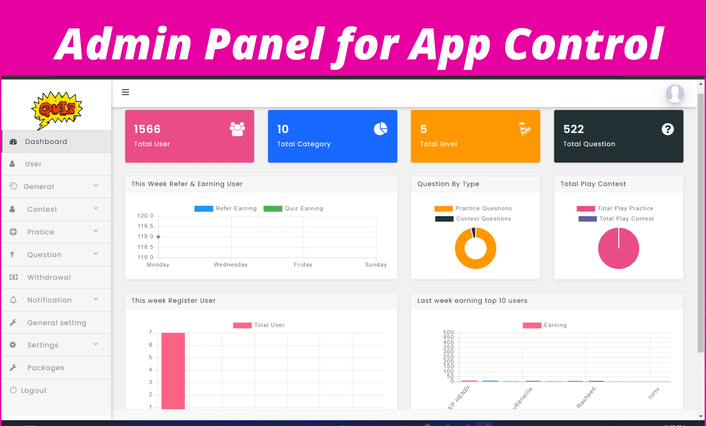

# Recueil de Besoin UX/UI
  
## Candidat

1. page Accueil type Login
    - input Nom
    - input Prenom
    - input Mail
    - bouton submit
2. si pas log, page renseignements
    - texte instruction + reprises info log
    - input Niveau (junior, senior,...)
    - input Type Poste (Dev, ux, ...)
    - bouton ajout CV
    - bouton ajout lettre motivation
    - bouton submit
3. si log ou renseigné, page Greetings - Instructions
    - titre
    - texte bienvenue avec reprises infos log
    - texte instruction
    - illustrations
    - affichage Timer
    - bouton submit
4. si trop de renseignements, page Instructions 2
5. page QCM Type
    - titre
    - texte instruction
    - reponses
    - échelle certitude
    - boutton submit
6. page Résultats
    - reprises questions avec bonnes reponses (montrer les reponses candidats)
    - graphiques?

## Admin

1. Navbar
    - Dashboard
    - Candidats
    - Quizzes
    - Supervision
    - Paramètres
2. Dashboard
    - Graphs (chart.js ?)
    - button ajout Quiz
    - button ajout Candidat
3. page Candidats
    - button ajout Candidat
    - liste candidats (menu 2 lat si navbar latterale -> scrollable)
4. page Candidat détails (à voir comment l'intégrer)
    - paragraphe details (nom, prenom,...)
    - visionneuse CV + lettre motiv?
    - button edit
    - button delete
    - graph passation épreuve (chart.js ?)
5. page Candidat new/edit (modale ?)
    - input Nom
    - input Prenom
    - input Mail
    - input Type de Poste
    - input prétension salariales
    - input Niveau
    - button ajout CV
    - button ajout LM
    - button submit
    - button delete
6. page Quizzes
   - button ajout Quiz
   - liste Quizzes
7. page Quiz détails
   - liste questions
   - affichage reponses (déroulant ?)
   - button edit (global ? sur chaque question ?)
   - button delete
8. page Quiz edit?
   - texte area instruction question
   - input reponse
   - button ajout reponse
   - button submit
   - button delete
9. page Settings Admin
10. page Supervision Épreuve
    - informations inscrites en live
  
## Inspiration
### Admin

